# Архитектура системы расчёта НМЦК — Mermaid-диаграммы

> Модель эмбеддингов: **Perplexity Embed v1 (pplx-embed-v1-0.6b)** — локальная модель, 1024-мерные векторы
> Все компоненты работают **локально**, без внешних API

---

## 1. Общая архитектура системы (C4 — контейнерная диаграмма)

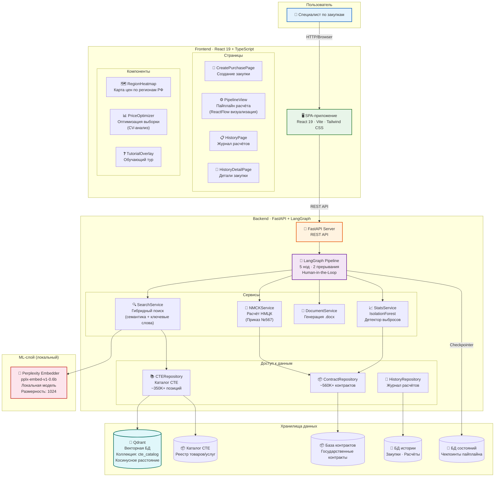

---

## 2. BPMN — Основной бизнес-процесс расчёта НМЦК

```mermaid
flowchart TD
    START(("⬤ Старт"))

    subgraph "Фаза 1: Инициализация закупки"
        A1["Пользователь открывает<br/>страницу создания закупки"]
        A2["Выбор региона<br/>(89 субъектов РФ)"]
        A3["Ввод наименований<br/>товаров/услуг<br/>(1..N строк)"]
        A4["Поиск позиций<br/>в каталоге СТЕ"]
        A5{"Найдены<br/>позиции?"}
        A6["Отметка выбранных<br/>СТЕ-позиций"]
        A7["Нажатие<br/>'Рассчитать НМЦК'"]
        A8["Создание записи<br/>закупки в БД"]
    end

    subgraph "Фаза 2: Семантический поиск аналогов"
        B1["Формирование запроса:<br/>название + категория"]
        B2["Perplexity Embed v1<br/>Векторизация запроса<br/>(1024-мерный вектор)"]
        B3["Поиск в Qdrant<br/>Косинусное сходство<br/>top_k=20, threshold≥0.5"]
        B4{"Результатов ≥ 3<br/>с фильтром<br/>категории?"}
        B5["Повторный поиск<br/>БЕЗ фильтра категории"]
        B6["Гибридное ранжирование:<br/>• Семантика (50%)<br/>• Ключевые слова (40%)<br/>• Атрибуты (10%)<br/>• Бонус категории (+5%)"]
        B7["Возврат top-10<br/>ранжированных аналогов"]
    end

    subgraph "Фаза 3: ⏸️ Утверждение аналогов (HITL #1)"
        C1["Отображение списка<br/>найденных аналогов"]
        C2["Показ метаданных:<br/>• Кол-во контрактов<br/>• Регионы поставок<br/>• Уникальные поставщики<br/>• Ед. измерения"]
        C3{"Пользователь<br/>выбирает аналоги"}
        C4["Добавление<br/>CTE ID вручную<br/>(опционально)"]
        C5["Добавление<br/>ручных цен<br/>(опционально)"]
        C6["Выбор единиц<br/>измерения"]
        C7["Нажатие<br/>'Утвердить аналоги'"]
    end

    subgraph "Фаза 4: Сбор и фильтрация цен"
        D1["Запрос контрактов<br/>по CTE ID аналогов"]
        D2["Фильтрация:<br/>• Регион (если задан)<br/>• Период (12 мес)<br/>• Единицы измерения"]
        D3{"Найдены<br/>контракты?"}
        D4["Расширение: поиск<br/>по ВСЕМ регионам"]
        D5{"Найдены?"}
        D6["Расширение периода<br/>до 24 месяцев"]
        D7["Расчёт временных весов:<br/>w = 1/(1 + days/365)"]
        D8["IsolationForest:<br/>детекция выбросов<br/>(contamination=auto)"]
        D9["Разделение на:<br/>✅ Валидные цены<br/>❌ Выбросы (с причиной)"]
    end

    subgraph "Фаза 5: ⏸️ Утверждение цен (HITL #2)"
        E1["Отображение таблицы цен<br/>с флагами выбросов"]
        E2["PriceOptimizer:<br/>расчёт CV, рекомендации<br/>по удалению"]
        E3["RegionHeatmap:<br/>тепловая карта<br/>цен по регионам"]
        E4{"Пользователь<br/>утверждает выборку"}
        E5["Добавление<br/>ручных цен<br/>(опционально)"]
        E6["Нажатие<br/>'Утвердить цены'"]
    end

    subgraph "Фаза 6: Расчёт НМЦК"
        F1["Повторный анализ<br/>утверждённых цен"]
        F2["Расчёт статистик:<br/>• Медиана<br/>• Среднее<br/>• Std. отклонение<br/>• CV = (σ/μ)×100%"]
        F3{"CV ≤ 33%?"}
        F4["Однородная выборка:<br/>база = средневзвешенная<br/>Ц_avg = Σ(Цi×wi)/Σ(wi)"]
        F5["Неоднородная выборка:<br/>база = медиана"]
        F6["НМЦК_ед = база × К_инфл"]
        F7["НМЦК = НМЦК_ед × кол-во"]
        F8["Диапазон цен:<br/>±(CV/100), max ±50%"]
    end

    subgraph "Фаза 7: Генерация документа"
        G1["Формирование .docx<br/>по Приказу №567"]
        G2["Разделы документа:<br/>1. Характеристики<br/>2. Метод (сопоставимых цен)<br/>3. Источники цен<br/>4. Формулы расчёта<br/>5. Таблица цен×весов<br/>6. Однородность (CV%)<br/>7. Исключённые выбросы<br/>8. Итого НМЦК (руб + прописью)<br/>9. Блок подписей"]
        G3["Сохранение документа<br/>в хранилище"]
    end

    subgraph "Фаза 8: Сохранение результатов"
        H1["Запись результатов<br/>в БД истории"]
        H2["Обновление статуса<br/>закупки"]
        H3{"Все позиции<br/>рассчитаны?"}
        H4["Отображение<br/>итоговой сводки"]
        H5["Генерация<br/>консолидированного .docx"]
    end

    FINISH(("⬤ Финиш"))

    START --> A1 --> A2 --> A3 --> A4 --> A5
    A5 -->|"Да"| A6
    A5 -->|"Нет"| A3
    A6 --> A7 --> A8

    A8 --> B1 --> B2 --> B3 --> B4
    B4 -->|"Да"| B6
    B4 -->|"Нет"| B5 --> B6
    B6 --> B7

    B7 --> C1 --> C2 --> C3
    C3 --> C4 --> C5 --> C6 --> C7

    C7 --> D1 --> D2 --> D3
    D3 -->|"Да"| D7
    D3 -->|"Нет (есть регион)"| D4 --> D5
    D5 -->|"Да"| D7
    D5 -->|"Нет"| D6 --> D7
    D7 --> D8 --> D9

    D9 --> E1 --> E2 --> E3 --> E4
    E4 --> E5 --> E6

    E6 --> F1 --> F2 --> F3
    F3 -->|"Да (однородная)"| F4
    F3 -->|"Нет (неоднородная)"| F5
    F4 --> F6
    F5 --> F6
    F6 --> F7 --> F8

    F8 --> G1 --> G2 --> G3

    G3 --> H1 --> H2 --> H3
    H3 -->|"Нет"| B1
    H3 -->|"Да"| H4 --> H5 --> FINISH

    style START fill:#4CAF50,stroke:#2E7D32,color:#fff
    style FINISH fill:#F44336,stroke:#C62828,color:#fff
    style C3 fill:#FF9800,stroke:#E65100,color:#fff
    style E4 fill:#FF9800,stroke:#E65100,color:#fff
    style F3 fill:#2196F3,stroke:#1565C0,color:#fff
    style B4 fill:#2196F3,stroke:#1565C0,color:#fff
    style D3 fill:#2196F3,stroke:#1565C0,color:#fff
    style D5 fill:#2196F3,stroke:#1565C0,color:#fff
    style H3 fill:#2196F3,stroke:#1565C0,color:#fff
    style A5 fill:#2196F3,stroke:#1565C0,color:#fff
```

---

## 3. LangGraph — Конечный автомат пайплайна

```mermaid
stateDiagram-v2
    [*] --> init: Старт сессии

    state "perform_search" as search {
        [*] --> embed_query: Формирование запроса
        embed_query --> qdrant_search: Perplexity Embed v1\n→ 1024-мерный вектор
        qdrant_search --> check_count: Qdrant cosine search\ntop_k=20
        check_count --> retry_no_filter: results < 3 && category
        check_count --> hybrid_rank: results >= 3
        retry_no_filter --> hybrid_rank: Merge results
        hybrid_rank --> [*]: Top-10 аналогов\nсохранены в state
    }

    state "wait_for_analogs ⏸️" as wait_analogs {
        [*] --> show_analogs: interrupt()
        show_analogs --> user_selects: Пользователь\nпросматривает аналоги
        user_selects --> add_manual: + ручные CTE ID
        add_manual --> add_prices: + ручные цены
        add_prices --> set_units: Выбор ед. измерения
        set_units --> [*]: Command(resume=data)
    }

    state "process_prices" as prices {
        [*] --> fetch_contracts: Запрос контрактов
        fetch_contracts --> filter_region: Фильтр: регион
        filter_region --> check_empty: Результат
        check_empty --> expand_all_regions: 0 записей → все регионы
        check_empty --> add_weights: > 0 записей
        expand_all_regions --> expand_24m: 0 → расширить до 24 мес
        expand_all_regions --> add_weights: > 0
        expand_24m --> add_weights
        add_weights --> isolation_forest: w = 1/(1+days/365)
        isolation_forest --> split_results: IsolationForest\ncontamination=auto
        split_results --> price_interrupt: valid / outliers
        price_interrupt --> user_reviews: interrupt()
        user_reviews --> [*]: Command(resume=data)
    }

    state "calculate_nmcc" as calc {
        [*] --> re_analyze: analyze_prices()
        re_analyze --> compute_stats: Медиана, среднее, CV
        compute_stats --> check_cv: CV ≤ 33%?
        check_cv --> use_weighted: Однородная → Ц_avg
        check_cv --> use_median: Неоднородная → медиана
        use_weighted --> nmck_formula
        use_median --> nmck_formula
        nmck_formula --> [*]: НМЦК = база × К_инфл × кол-во
    }

    state "generate_document" as doc {
        [*] --> build_docx: Генерация документа
        build_docx --> write_sections: 9 разделов\nпо Приказу №567
        write_sections --> save_file: Сохранение .docx
        save_file --> [*]: document_path → state
    }

    init --> search
    search --> wait_analogs: current_step = analogs_found
    wait_analogs --> prices: current_step = analogs_approved
    prices --> calc: current_step = prices_approved
    calc --> doc: current_step = nmcc_calculated
    doc --> [*]: current_step = document_generated
```

---

## 4. Sequence-диаграмма — Полный цикл взаимодействия Frontend ↔ Backend

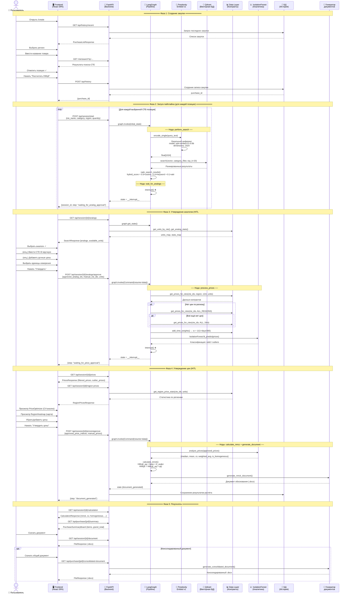

---

## 5. Архитектура ML-пайплайна — Поиск и аналитика

```mermaid
flowchart LR
    subgraph "Индексация (при старте сервера)"
        CTE_DS["📦 Каталог СТЕ<br/>~350K+ позиций"]
        BATCH["Батчевая обработка<br/>256 позиций/батч"]
        PPLX_INDEX["🧠 Perplexity Embed v1<br/>pplx-embed-v1-0.6b<br/>Локальный инференс"]
        VECTORS["float[1024] × N"]
        UPSERT["Batch Upsert<br/>256 записей/батч"]
        QDRANT_STORE[("🔷 Qdrant<br/>cte_catalog<br/>Cosine Distance")]

        CTE_DS --> BATCH --> PPLX_INDEX --> VECTORS --> UPSERT --> QDRANT_STORE
    end

    subgraph "Поиск (runtime)"
        QUERY["🔤 Запрос пользователя<br/>название + категория"]
        PPLX_QUERY["🧠 Perplexity Embed v1<br/>encode_single()"]
        QUERY_VEC["float[1024]"]

        subgraph "Qdrant Search"
            COSINE["Косинусное<br/>сходство"]
            CAT_FILTER["Фильтр<br/>категории"]
            THRESHOLD["score ≥ 0.5"]
        end

        subgraph "Гибридное ранжирование"
            SEM_SCORE["Семантика<br/>вес: 50%"]
            KW_SCORE["Ключевые слова<br/>вес: 40%<br/>(word overlap)"]
            ATTR_SCORE["Атрибуты<br/>вес: 10%<br/>(characteristic match)"]
            CAT_BONUS["Бонус категории<br/>+5%"]
            FINAL_RANK["final_score =<br/>0.5×cosine +<br/>0.4×keyword +<br/>0.1×attr +<br/>0.05×cat_match"]
        end

        RESULTS["📋 Top-10<br/>аналогов"]

        QUERY --> PPLX_QUERY --> QUERY_VEC --> COSINE
        QUERY_VEC --> CAT_FILTER
        COSINE --> THRESHOLD
        CAT_FILTER --> THRESHOLD
        THRESHOLD --> SEM_SCORE
        THRESHOLD --> KW_SCORE
        THRESHOLD --> ATTR_SCORE
        THRESHOLD --> CAT_BONUS
        SEM_SCORE --> FINAL_RANK
        KW_SCORE --> FINAL_RANK
        ATTR_SCORE --> FINAL_RANK
        CAT_BONUS --> FINAL_RANK
        FINAL_RANK --> RESULTS
    end

    subgraph "Ценовая аналитика"
        PRICES_IN["💰 Цены контрактов"]

        subgraph "Предобработка"
            TIME_W["Временные веса<br/>w = 1/(1 + days/365)"]
            REGION_F["Фильтр региона"]
            UNIT_F["Фильтр ед. измерения"]
        end

        subgraph "IsolationForest (scikit-learn)"
            IF_MODEL["IsolationForest<br/>contamination='auto'"]
            IF_PREDICT["predict() → {valid, outlier}"]
            IF_REASON["Причина выброса:<br/>% отклонения от медианы"]
        end

        subgraph "Статистический анализ"
            MEDIAN["Медиана"]
            MEAN["Среднее"]
            STD_DEV["σ (std)"]
            CV_CALC["CV = (σ/μ) × 100%"]
            WAVG["Ц_avg = Σ(Цi×wi)/Σ(wi)"]
            HOMOG{"CV ≤ 33%?"}
        end

        PRICES_IN --> TIME_W --> REGION_F --> UNIT_F
        UNIT_F --> IF_MODEL --> IF_PREDICT --> IF_REASON
        IF_REASON --> MEDIAN
        IF_REASON --> MEAN
        IF_REASON --> STD_DEV
        MEDIAN --> CV_CALC
        MEAN --> CV_CALC
        STD_DEV --> CV_CALC
        MEAN --> WAVG
        CV_CALC --> HOMOG
    end

    style PPLX_INDEX fill:#FCE4EC,stroke:#C62828
    style PPLX_QUERY fill:#FCE4EC,stroke:#C62828
    style QDRANT_STORE fill:#E0F7FA,stroke:#00695C
    style IF_MODEL fill:#F3E5F5,stroke:#6A1B9A
    style HOMOG fill:#FFF9C4,stroke:#F57F17
```

---

## 6. Модель данных

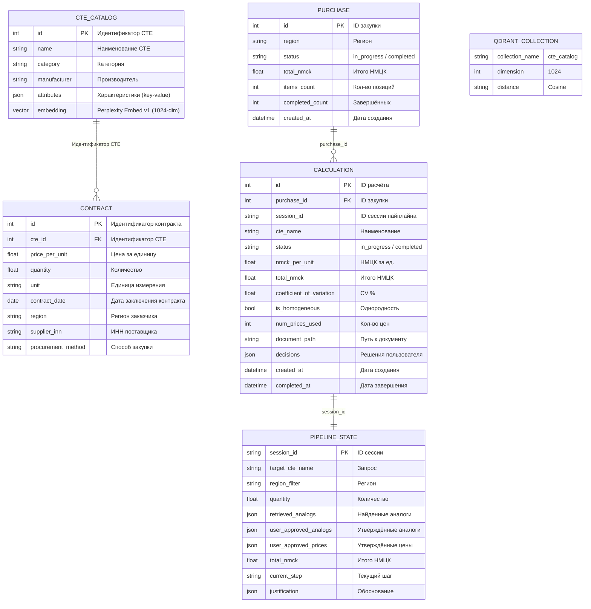

---

## 7. Диаграмма компонентов Frontend

```mermaid
flowchart TB
    subgraph "React Router DOM v7"
        ROUTER["🔀 BrowserRouter"]
    end

    subgraph "Layouts"
        HEADER["🧭 Header<br/>• Логотип<br/>• Навигация:<br/>  Новый расчёт | История"]
        TUTORIAL_BTN["❓ TutorialHelpButton<br/>Плавающая кнопка помощи"]
    end

    subgraph "Страница: / (CreatePurchasePage)"
        direction TB
        CP_REGION["🗺️ RegionSelector<br/>Автокомплит<br/>89 субъектов РФ"]
        CP_ROWS["📝 ItemSearchRow × N<br/>• Поиск СТЕ<br/>• Результаты с toggle<br/>• Добавить/удалить строку"]
        CP_RECENT["🕐 RecentPurchases<br/>Карусель последних закупок"]
        CP_SUBMIT["🚀 Кнопка 'Рассчитать НМЦК'<br/>→ navigate(/pipeline?...)"]

        CP_REGION --> CP_ROWS --> CP_SUBMIT
        CP_RECENT
    end

    subgraph "Страница: /pipeline (PipelineView)"
        direction TB
        PV_GRAPH["🔄 ReactFlow Graph<br/>5 этапов × N позиций<br/>Цветовые группы<br/>Статусы: ✅⏳🔵"]

        subgraph "Боковая панель (Inspector)"
            PV_ANALOGS["📋 Список аналогов<br/>• Выбор checkbox<br/>• Ручной ввод CTE ID<br/>• Ручной ввод цен<br/>• Выбор единиц"]
            PV_PRICES["💰 Таблица цен<br/>• Toggle включения<br/>• Флаги выбросов<br/>• Область поиска"]
            PV_CALC["🧮 Результат расчёта<br/>• НМЦК, CV%, однородность<br/>• Скачать .docx"]
        end

        PV_HEATMAP["🗺️ RegionHeatmap<br/>Интерактивная карта РФ<br/>Градиент: зелёный→красный<br/>Таблица с сортировкой"]
        PV_OPTIMIZER["📊 PriceOptimizer<br/>CV progress bar (33%)<br/>ML-рекомендации<br/>по оптимизации выборки"]
        PV_SUMMARY["📊 SummaryBoard<br/>Итоговая сводка<br/>Grand total + прописью"]

        PV_GRAPH --> PV_ANALOGS
        PV_GRAPH --> PV_PRICES
        PV_GRAPH --> PV_CALC
        PV_PRICES --> PV_HEATMAP
        PV_PRICES --> PV_OPTIMIZER
    end

    subgraph "Страница: /history (HistoryPage)"
        HP_LIST["📋 Список закупок<br/>Пагинация<br/>Группировка по времени"]
        HP_FILTER["🔍 Фильтр статуса<br/>Все | Завершённые | В процессе"]
        HP_ACTIONS["⚡ Действия:<br/>Открыть | Продолжить |<br/>Повторить | Удалить"]
    end

    subgraph "Страница: /history/:id (HistoryDetailPage)"
        HD_CARDS["📄 Карточки расчётов<br/>Развёрнутые/свёрнутые"]
        HD_METRICS["📊 Метрики:<br/>НМЦК | CV | Однородность"]
        HD_DOWNLOAD["⬇️ Скачать .docx"]
        HD_CONTINUE["▶️ Продолжить расчёт"]
    end

    subgraph "Контекст"
        TUTORIAL_CTX["🎓 TutorialProvider<br/>5 шагов обучающего тура"]
        TUTORIAL_OVL["🔦 TutorialOverlay<br/>Spotlight + Dialog"]
    end

    subgraph "API Client"
        API_CLIENT["📡 REST API Client<br/>• startSession()<br/>• getAnalogs()<br/>• approveAnalogs()<br/>• getPrices()<br/>• approvePrices()<br/>• getCalculation()<br/>• downloadDocument()<br/>• getRegionPrices()<br/>• createPurchase()<br/>• listPurchases()<br/>• getPurchaseSummary()"]
    end

    ROUTER --> HEADER
    ROUTER -->|"/"| CP_REGION
    ROUTER -->|"/pipeline"| PV_GRAPH
    ROUTER -->|"/history"| HP_LIST
    ROUTER -->|"/history/:id"| HD_CARDS
    TUTORIAL_CTX --> TUTORIAL_OVL
    TUTORIAL_BTN --> TUTORIAL_CTX
    API_CLIENT -.->|"HTTP"| CP_ROWS
    API_CLIENT -.->|"HTTP"| PV_GRAPH
    API_CLIENT -.->|"HTTP"| HP_LIST
    API_CLIENT -.->|"HTTP"| HD_CARDS

    style ROUTER fill:#E3F2FD,stroke:#1565C0
    style PV_GRAPH fill:#F3E5F5,stroke:#6A1B9A
    style PV_HEATMAP fill:#E8F5E9,stroke:#2E7D32
    style PV_OPTIMIZER fill:#FFF3E0,stroke:#E65100
    style API_CLIENT fill:#FFEBEE,stroke:#C62828
```

---

## 8. Диаграмма развёртывания (Docker)

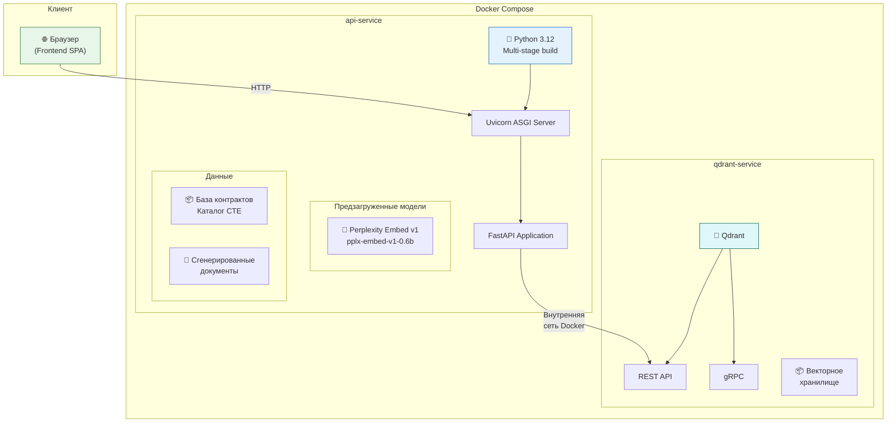

---

## 9. Формулы расчёта НМЦК (по Приказу Минэкономразвития №567)

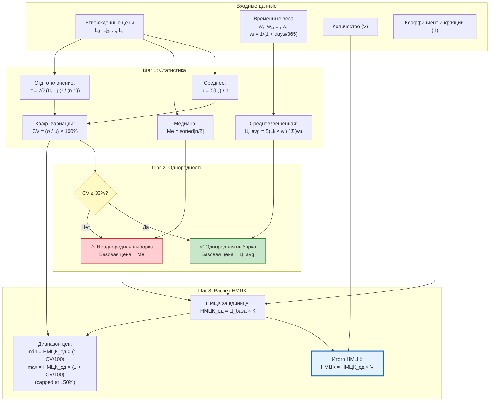

---

## 10. API Endpoints — полная карта

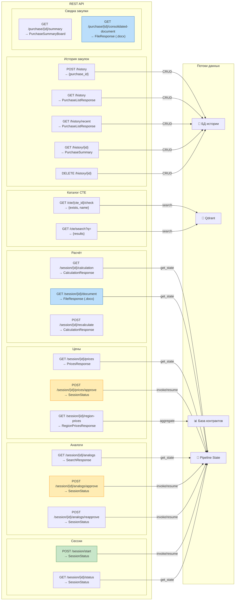

---

## 11. Пользовательские потоки (User Journeys)

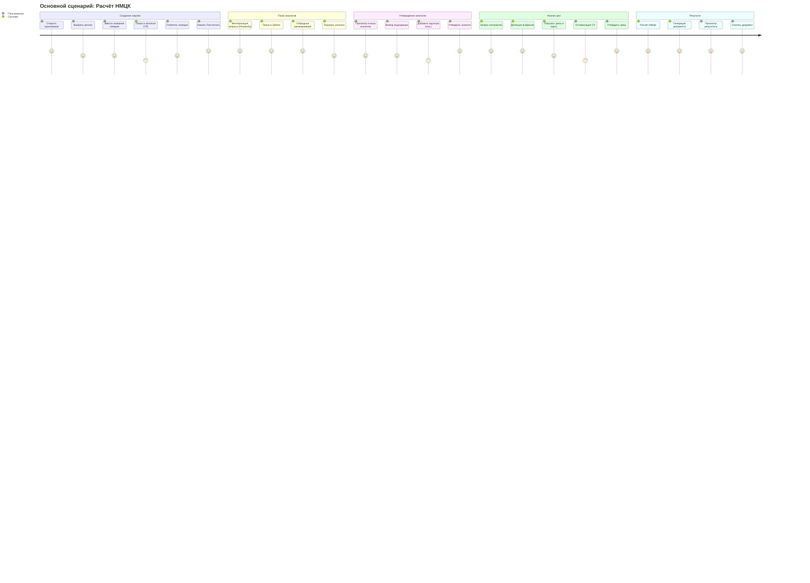

---

## 12. Fallback-стратегия поиска цен

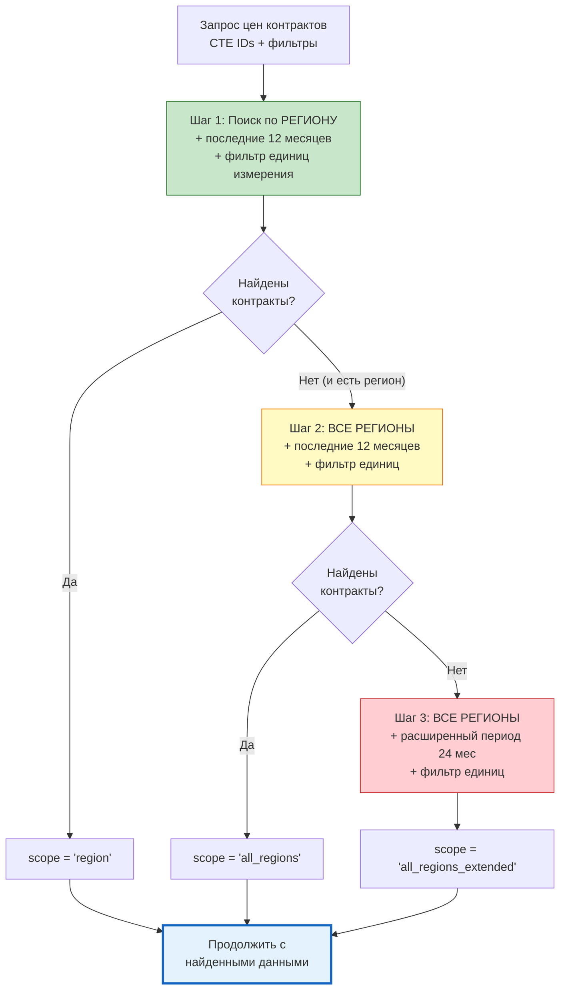

---

## 13. Алгоритм PriceOptimizer (Frontend)

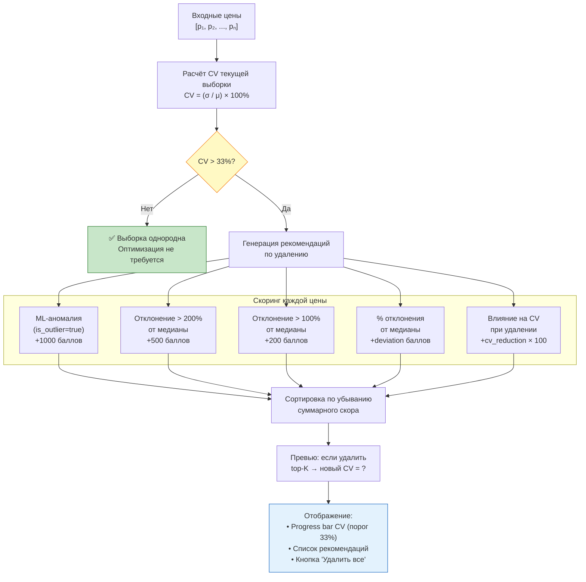

---

## Используемые технологии (сводка)

| Слой | Технология | Назначение |
|------|-----------|------------|
| **Frontend** | React 19 + TypeScript | SPA-приложение |
| **Сборка** | Vite | Dev-сервер и бандлинг |
| **Стили** | Tailwind CSS | Утилитарный CSS |
| **Графы** | ReactFlow | Визуализация пайплайна |
| **Карты** | react-simple-maps | Тепловая карта регионов РФ |
| **Backend** | FastAPI + Uvicorn | REST API сервер |
| **Пайплайн** | LangGraph | Конечный автомат с HITL |
| **Эмбеддинги** | Perplexity Embed v1 (pplx-embed-v1-0.6b) | Локальная векторизация текста (1024-dim) |
| **Векторная БД** | Qdrant | Семантический поиск аналогов |
| **Аналитика данных** | Polars | Высокопроизводительная обработка контрактов |
| **ML** | scikit-learn (IsolationForest) | Детекция ценовых выбросов |
| **Контейнеризация** | Docker + Docker Compose | Развёртывание |
