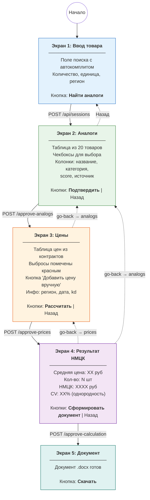
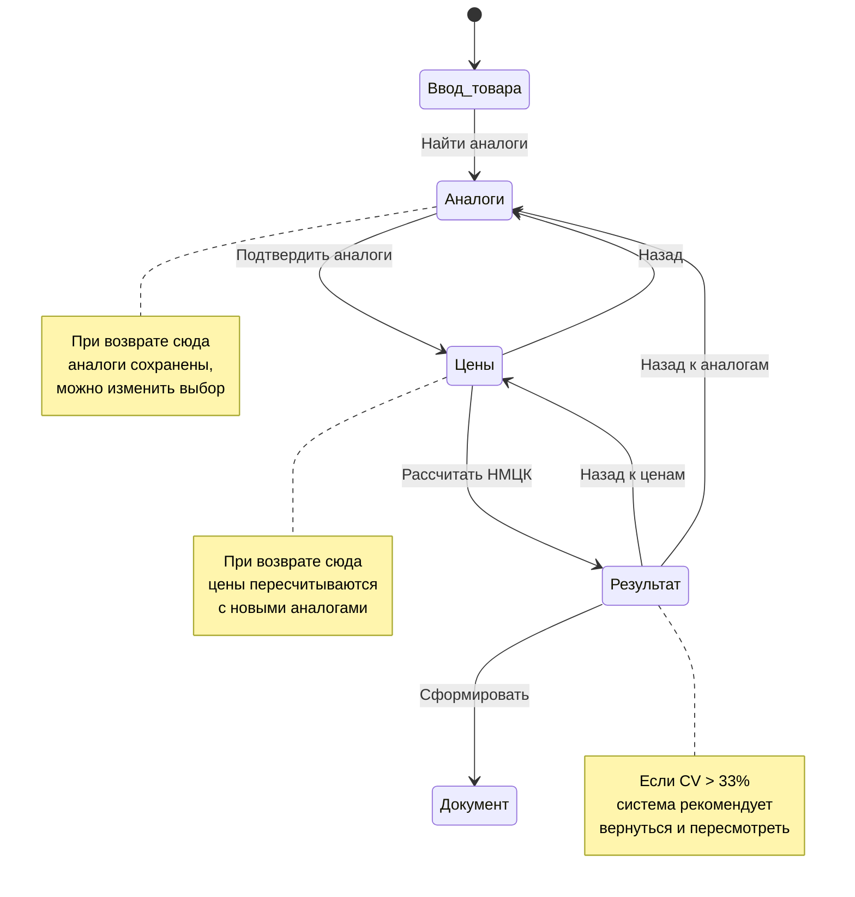
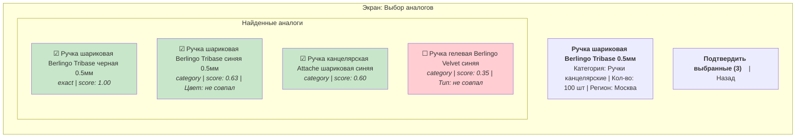
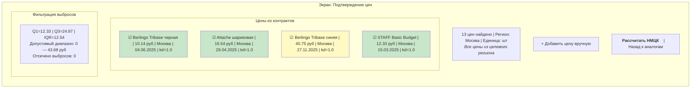
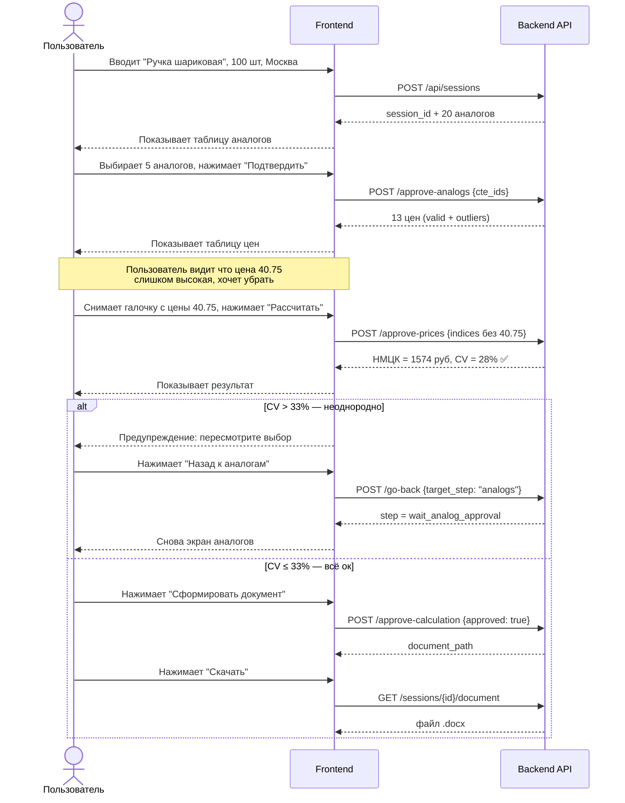

# Диаграммы

## UI User Story — путь пользователя



## Навигация между шагами (go-back)



## Экран 2: что видит пользователь (аналоги)



## Экран 3: что видит пользователь (цены)



## Экран 4: результат НМЦК

```mermaid
flowchart LR
    subgraph screen["Экран: Результат расчёта"]
        direction TB
        TITLE["<b>РЕЗУЛЬТАТ РАСЧЁТА НМЦК</b>"]

        subgraph calc["Расчёт по Приказу 567"]
            direction TB
            C1["Средняя цена за единицу: <b>19.07 руб</b>"]
            C2["Среднеквадратичное отклонение: <b>8.74 руб</b>"]
            C3["Коэффициент вариации: <b>45.83%</b> ⚠️ > 33%"]
            C4["Использовано источников: <b>13</b>"]
        end

        subgraph nmcc[""]
            direction TB
            FORMULA["НМЦК = 19.07 × 100 = <b>1 906.77 руб</b>"]
        end

        WARNING["⚠️ НЕОДНОРОДНАЯ ВЫБОРКА<br/>Рекомендуется пересмотреть выбор аналогов или цен"]

        BUTTONS3["<b>Сформировать документ</b> | Назад к ценам | Назад к аналогам"]
    end

    style C3 fill:#fff9c4
    style WARNING fill:#ffcdd2
    style FORMULA fill:#e8f5e9
```

## Полный Sequence — включая возвраты


