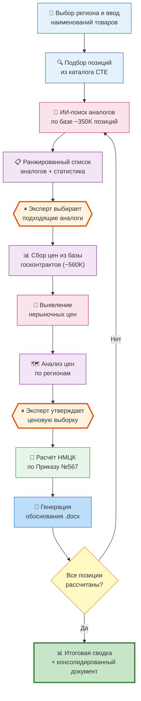

# Бизнес-процесс расчёта НМЦК

```mermaid
flowchart TD
    A["👤 Выбор региона и ввод\nнаименований товаров"] --> B["🔍 Подбор позиций\nиз каталога СТЕ"]
    B --> C["🧠 ИИ-поиск аналогов\nпо базе ~350K позиций"]
    C --> D["📋 Ранжированный список\nаналогов + статистика"]
    D --> E{{"⏸ Эксперт выбирает\nподходящие аналоги"}}
    E --> F["📊 Сбор цен из базы\nгосконтрактов (~560K)"]
    F --> G["🧠 Выявление\nнерыночных цен"]
    G --> H["🗺 Анализ цен\nпо регионам"]
    H --> I{{"⏸ Эксперт утверждает\nценовую выборку"}}
    I --> J["🧮 Расчёт НМЦК\nпо Приказу №567"]
    J --> K["📄 Генерация\nобоснования .docx"]
    K --> L{"Все позиции\nрассчитаны?"}
    L -->|"Нет"| C
    L -->|"Да"| M["📊 Итоговая сводка\n+ консолидированный документ"]

    style A fill:#E3F2FD,stroke:#1565C0
    style B fill:#E3F2FD,stroke:#1565C0
    style C fill:#FCE4EC,stroke:#C62828
    style D fill:#F3E5F5,stroke:#7B1FA2
    style E fill:#FFF3E0,stroke:#E65100,stroke-width:3px
    style F fill:#F3E5F5,stroke:#7B1FA2
    style G fill:#FCE4EC,stroke:#C62828
    style H fill:#F3E5F5,stroke:#7B1FA2
    style I fill:#FFF3E0,stroke:#E65100,stroke-width:3px
    style J fill:#E8F5E9,stroke:#2E7D32
    style K fill:#BBDEFB,stroke:#1565C0
    style L fill:#FFF9C4,stroke:#F57F17
    style M fill:#C8E6C9,stroke:#2E7D32,stroke-width:3px
```
