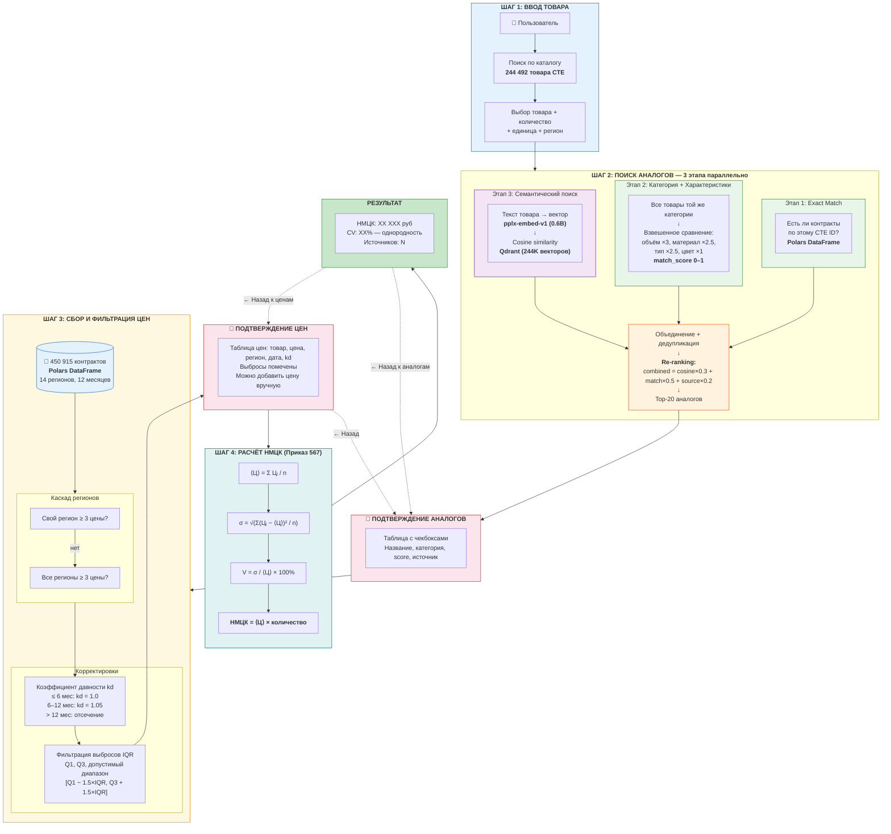
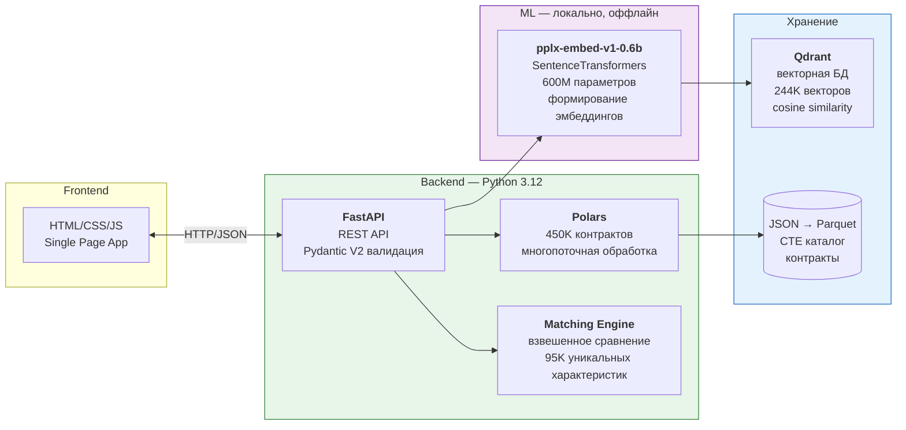
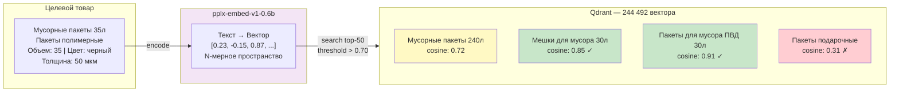
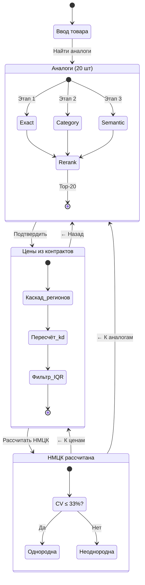

# Полная архитектура системы расчёта НМЦК

## Главная схема — как всё работает

```mermaid
flowchart TB
    subgraph INPUT["<b>ШАГ 1: ВВОД ТОВАРА</b>"]
        direction LR
        USER["👤 Пользователь"] --> SEARCH["Поиск по каталогу<br/><b>244 492 товара СТЕ</b>"]
        SEARCH --> SELECT["Выбор товара + количество<br/>+ единица + регион"]
    end

    SELECT --> PIPELINE

    subgraph PIPELINE["<b>ШАГ 2: ПОИСК АНАЛОГОВ — 3 этапа параллельно</b>"]
        direction TB

        subgraph E1["Этап 1: Exact Match"]
            direction TB
            E1_DESC["Есть ли контракты<br/>по этому CTE ID?<br/><b>Polars DataFrame</b>"]
        end

        subgraph E2["Этап 2: Категория + Характеристики"]
            direction TB
            E2_DESC["Все товары той же категории<br/>↓<br/>Взвешенное сравнение:<br/>объём ×3, материал ×2.5,<br/>тип ×2.5, цвет ×1<br/><b>match_score 0–1</b>"]
        end

        subgraph E3["Этап 3: Семантический поиск"]
            direction TB
            E3_DESC["Текст товара → вектор<br/><b>pplx-embed-v1 (0.6B)</b><br/>↓<br/>Cosine similarity<br/><b>Qdrant (244K векторов)</b>"]
        end

        E1 --> MERGE
        E2 --> MERGE
        E3 --> MERGE

        MERGE["Объединение + дедупликация<br/>↓<br/><b>Re-ranking:</b><br/>combined = cosine×0.3 + match×0.5 + source×0.2<br/>↓<br/>Top-20 аналогов"]
    end

    MERGE --> HUMAN1

    subgraph HUMAN1["<b>👤 ПОДТВЕРЖДЕНИЕ АНАЛОГОВ</b>"]
        direction LR
        H1["Таблица с чекбоксами<br/>Название, категория, score, источник"]
    end

    HUMAN1 --> PRICES

    subgraph PRICES["<b>ШАГ 3: СБОР И ФИЛЬТРАЦИЯ ЦЕН</b>"]
        direction TB

        subgraph CASCADE["Каскад регионов"]
            direction TB
            R1["Свой регион ≥ 3 цены?"] -->|нет| R2["Все регионы ≥ 3 цены?"]
        end

        subgraph ADJUST["Корректировки"]
            direction TB
            KD["Коэффициент давности kd<br/>≤ 6 мес: kd = 1.0<br/>6–12 мес: kd = 1.05<br/>> 12 мес: отсечение"]
            IQR["Фильтрация выбросов IQR<br/>Q1, Q3, допустимый диапазон<br/>[Q1 − 1.5×IQR, Q3 + 1.5×IQR]"]
        end

        CASCADE --> KD --> IQR

        DB[("💾 450 915 контрактов<br/><b>Polars DataFrame</b><br/>14 регионов, 12 месяцев")]
        DB --> CASCADE
    end

    IQR --> HUMAN2

    subgraph HUMAN2["<b>👤 ПОДТВЕРЖДЕНИЕ ЦЕН</b>"]
        direction LR
        H2["Таблица цен: товар, цена, регион, дата, kd<br/>Выбросы помечены<br/>Можно добавить цену вручную"]
    end

    HUMAN2 --> CALC

    subgraph CALC["<b>ШАГ 4: РАСЧЁТ НМЦК (Приказ 567)</b>"]
        direction TB
        F1["⟨Ц⟩ = Σ Цᵢ / n"]
        F2["σ = √(Σ(Цᵢ − ⟨Ц⟩)² / n)"]
        F3["V = σ / ⟨Ц⟩ × 100%"]
        F4["<b>НМЦК = ⟨Ц⟩ × количество</b>"]
        F1 --> F2 --> F3 --> F4
    end

    CALC --> RESULT

    subgraph RESULT["<b>РЕЗУЛЬТАТ</b>"]
        direction TB
        RES["НМЦК: XX XXX руб<br/>CV: XX% — однородность<br/>Источников: N"]
    end

    %% Возвраты
    HUMAN2 -.->|"← Назад"| HUMAN1
    RESULT -.->|"← Назад к ценам"| HUMAN2
    RESULT -.->|"← Назад к аналогам"| HUMAN1

    style INPUT fill:#e3f2fd,stroke:#1565c0
    style E1 fill:#e8f5e9,stroke:#2e7d32
    style E2 fill:#e8f5e9,stroke:#2e7d32
    style E3 fill:#f3e5f5,stroke:#6a1b9a
    style MERGE fill:#fff3e0,stroke:#e65100
    style HUMAN1 fill:#fce4ec,stroke:#c62828
    style HUMAN2 fill:#fce4ec,stroke:#c62828
    style PRICES fill:#fff8e1,stroke:#f57f17
    style CALC fill:#e0f2f1,stroke:#00695c
    style RESULT fill:#c8e6c9,stroke:#2e7d32
    style DB fill:#e3f2fd,stroke:#1565c0
```

## Технологический стек

```mermaid
flowchart LR
    subgraph frontend["Frontend"]
        UI["HTML/CSS/JS<br/>Single Page App"]
    end

    subgraph backend["Backend — Python 3.12"]
        API["<b>FastAPI</b><br/>REST API<br/>Pydantic V2 валидация"]
        POLARS["<b>Polars</b><br/>450K контрактов<br/>многопоточная обработка"]
        MATCH["<b>Matching Engine</b><br/>взвешенное сравнение<br/>95K уникальных характеристик"]
    end

    subgraph ml["ML — локально, оффлайн"]
        EMBED["<b>pplx-embed-v1-0.6b</b><br/>SentenceTransformers<br/>600M параметров<br/>формирование эмбеддингов"]
    end

    subgraph storage["Хранение"]
        QDRANT["<b>Qdrant</b><br/>векторная БД<br/>244K векторов<br/>cosine similarity"]
        DATA[("JSON → Parquet<br/>CTE каталог<br/>контракты")]
    end

    UI <-->|"HTTP/JSON"| API
    API --> POLARS
    API --> MATCH
    API --> EMBED
    EMBED --> QDRANT
    POLARS --> DATA

    style ml fill:#f3e5f5,stroke:#6a1b9a
    style storage fill:#e3f2fd,stroke:#1565c0
    style backend fill:#e8f5e9,stroke:#2e7d32
```

## Как работает семантический поиск

```mermaid
flowchart LR
    subgraph input["Целевой товар"]
        T1["Мусорные пакеты 35л<br/>Пакеты полимерные<br/>Объем: 35 | Цвет: черный<br/>Толщина: 50 мкм"]
    end

    subgraph model["pplx-embed-v1-0.6b"]
        M1["Текст → Вектор<br/>[0.23, -0.15, 0.87, ...]<br/>N-мерное пространство"]
    end

    subgraph qdrant["Qdrant — 244 492 вектора"]
        Q1["Мусорные пакеты 240л<br/>cosine: 0.72"]
        Q2["Мешки для мусора 30л<br/>cosine: 0.85 ✓"]
        Q3["Пакеты для мусора ПВД 30л<br/>cosine: 0.91 ✓"]
        Q4["Пакеты подарочные<br/>cosine: 0.31 ✗"]
    end

    T1 -->|"encode"| M1
    M1 -->|"search top-50<br/>threshold > 0.70"| qdrant

    style Q2 fill:#c8e6c9
    style Q3 fill:#c8e6c9
    style Q1 fill:#fff9c4
    style Q4 fill:#ffcdd2
    style model fill:#f3e5f5
```

## User Journey — полный путь с возвратами

```mermaid
stateDiagram-v2
    [*] --> Ввод

    state "Ввод товара" as Ввод
    state "Аналоги (20 шт)" as Аналоги
    state "Цены из контрактов" as Цены
    state "НМЦК рассчитана" as Результат

    Ввод --> Аналоги : Найти аналоги

    state Аналоги {
        [*] --> Exact : Этап 1
        [*] --> Category : Этап 2
        [*] --> Semantic : Этап 3
        Exact --> Rerank
        Category --> Rerank
        Semantic --> Rerank
        Rerank --> [*] : Top-20
    }

    Аналоги --> Цены : Подтвердить

    state Цены {
        [*] --> Каскад_регионов
        Каскад_регионов --> Пересчёт_kd
        Пересчёт_kd --> Фильтр_IQR
        Фильтр_IQR --> [*]
    }

    Цены --> Результат : Рассчитать НМЦК

    state Результат {
        [*] --> check
        state "CV ≤ 33%?" as check
        check --> Однородна : Да
        check --> Неоднородна : Нет
    }

    Цены --> Аналоги : ← Назад
    Результат --> Цены : ← К ценам
    Результат --> Аналоги : ← К аналогам
```
